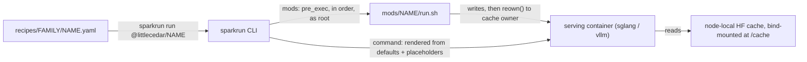

# Repository Guidelines

Registry of **sparkrun** deployment recipes for Little Cedar Group's 6-node DGX Spark cluster
(GB10 Blackwell, 128 GB unified LPDDR5X, 200 GbE CX7 RoCE). The tree is git-distributed to the
cluster and to third parties, and is consumed by the `sparkrun` CLI as the `littlecedar` registry
(`Trusted=yes`, so recipe mods run unprompted at launch). There is no compiled application here:
the "source" is recipe YAML, bash mods, and stdlib-only Python tools and guards.

Counts in this document were verified 2026-10-07 against the working tree. Facts drift — re-measure
(`ls recipes/*/*.yaml`, test discovery) before trusting a number.

## Project Overview

- **Recipes** (`recipes/`, 24 files in 5 family dirs) — v2 recipe definitions consumed by
  `sparkrun run @littlecedar/<filename-minus-.yaml>` on the cluster.
- **Mods** (`mods/`, 27 shipped + `mod-template`) — pre-launch container hooks that patch or stage
  files inside the serving image before the engine execs.
- **Benchmarking** (`benchmarking/`, 43 `llama-benchy` profiles + index README) — the curated
  profile library used by `sparkrun benchmark performance`.
- **Tuning** (`tuning/`) — only `README.md` is tracked; Triton MoE tuning configs are generated at
  runtime by `sparkrun tune` and no recipe references a vendored config.
- **Tests/tools** (`tests/`, `tools/`) — artifact guards and measurement CLIs; intentionally
  stdlib-only so they run on a head node, in a container, or on a laptop with no venv.

## Architecture & Data Flow



Load-bearing contracts:

- **`defaults:` reaches the engine only through a `{placeholder}`** in `command:` (or a runtime flag
  map / internal key). `sparkrun/core/launcher.py:683` `report_unmapped_config_keys` otherwise warns
  `unmapped-config-key`. Never delete a placeholder to silence a warning, and never add a default
  nothing consumes — sparkrun renders unmapped defaults silently.
- **`command:` is YAML folded `>`** (24/24 recipes). JSON-shaped defaults must keep their shell
  quotes inside the fold — `limit_mm_per_prompt: >-` with `'{"image": 4, "video": 1}'` — or
  word-splitting hands the engine four arguments.
- **`mods:` is an ordered dependency chain, not a set.** Recipe comments
  (`ORDER MATTERS`, `keep the config mod first`, `Must run LAST`) are load-bearing; reordering a
  labquant/EXL3 chain yields a tree that boots, answers, and is numerically wrong.
- **Mods run as root** in the container and must `reown()` anything created under `/cache/runtime` to
  the cache mount's UID/GID, or downstream user processes fail on root-owned leftovers. A non-zero
  mod exit tears the whole launch down, so transient failures log and continue.
- **Each runner node has its own HF cache** at `${WOPR_USER_CACHE}/huggingface` mounted at `/cache`.
  There is no shared `/cache/models`; sparkrun distributes every model to each serving node.

## Key Directories

| Path | Contents |
|---|---|
| `recipes/ds4/` (3), `recipes/ifm/` (8), `recipes/ornith/` (2), `recipes/qwen3/` (7), `recipes/qwen4/` (4) | Recipes by model family, with per-lane `README.md`/`AGENTS.md`/`NOTES.md` |
| `recipes/glm/` | `GLM-5.3-RECOMMENDATIONS.md` only — no recipes yet |
| `attic/` | Tracked recipe/doc archive: 5 retired EXL3 vLLM recipes (+ tuning configs) in `attic/ds4/`, 24 arms + `ARMS-MANIFEST.md` in `attic/qwen4/`, `attic/ornith/`, `attic/mad-science/`. Not served by the registry, but referenced by tests, benchmarks, and tools |
| `mods/` | One self-contained directory per mod; `mod-template/` is the authoritative harness |
| `tests/` | 10 importable guard modules, `k2_36b_arith.py` helper, one skipped `*.sync-conflict-*.py` |
| `tools/` | 8 stdlib CLIs (pooling-bench, needle-haystack, quality-battery, build-dsv41-*, gate-37111, qwen4-quality-eval, synthetic_png) |
| `benchmarking/` | 43 profiles + README index (flat, recipe-agnostic) |
| `.sparkrun/registry.yaml` | Registry manifest: `recipes: recipes`, `tuning: tuning`, `benchmarks: benchmarking`, `mods: mods` |
| `.local/` | Git-ignored: `CONFIDENTIAL.md` (defines `${WOPR_*}` cluster vars), `sparkrun-home/` (HOME override) |

## Development Commands

```bash
uv sync                        # netifaces has no wheel — builds from sdist, needs a C toolchain
mkdir -p .local/sparkrun-home  # fresh clone; git-ignored
sparkrun --version             # requires >= 0.3.8 (0.4.0 verified locally)
```

**Every `sparkrun` call needs the HOME override**, otherwise it dies on
`PermissionError: ~/.config/sparkrun/registries.yaml` before reading any recipe:

```bash
H=$PWD/.local/sparkrun-home
HOME="$H" sparkrun recipe validate recipes/qwen4/qwen3.8-flash-next-nvfp4-sglang.yaml
```

The repo-mandated gate after every edit:

```bash
set -e
H=$PWD/.local/sparkrun-home
uv run python -B -m unittest discover -s tests
for f in recipes/*/*.yaml; do HOME="$H" sparkrun recipe validate "$f" >/dev/null; done
for s in mods/*/*.sh; do bash -n "$s"; done
for p in mods/*/*.py tools/*.py; do uv run python -m py_compile "$p"; done
find mods tools tests -name __pycache__ -type d -exec rm -rf {} +
```

- **Plain `validate` is the gate, not `--strict`**: 24/24 pass plain; 4/24 fail strict on
  accepted warnings (`recipes/qwen3/qwen3.8-27b-nvfp4-dflash2-sglang.yaml` — `deprecated-topology`,
  and the three `recipes/qwen4/*labquant*` — `unpinned-model-revision`). Never edit a recipe merely
  to clear a `suggestion` (e.g. deliberate `/cache/runtime` paths flagged `restated-managed-path`).
- `py_compile` leaves `__pycache__/`; the suite's own child processes may recreate it even under
  `-B`, so keep the cleanup line.

Render before launching; `-n` alone errors with `No hosts specified`:

```bash
HOME="$H" sparkrun run <recipe> -H <node> -n            # print the rendered command
HOME="$H" sparkrun run <recipe> -H <node> -n | grep -- '--your-flag'
```

`-o key=value` overrides recipe defaults and `-b key=value` passes benchmark args (both repeatable);
`-v`/`-vv`/`-vvv`, `-q` for scripting. Lifecycle: `sparkrun status` → task IDs, `sparkrun logs <id>`,
`sparkrun stop <id>` (**no `sparkrun stop all`**).

```bash
HOME="$H" sparkrun benchmark performance <recipe> -H <node> --profile benchmarking/<name>.yaml \
  --output out.yaml          # flags: --solo --skip-run --no-stop --fresh --resume --timeout
HOME="$H" sparkrun tune sglang <recipe> -H <host>   # or: tune vllm
```

Remote GPU work is SSH to `${WOPR_HEAD_NODE}` as `${WOPR_USERNAME}`; run `sparkrun` from
`${WOPR_RUN_FROM_DIR}` with in-progress recipes symlinked from `${WOPR_SRC_DIR}`. Cluster mod
delivery needs `--transfer-mode local` (hidden option; `auto|local|push|delegated|pull`; persist
with `sparkrun cluster update <name> --transfer-mode local`), else the node clones the registry
itself and an unpushed mod is invisible.

## Code Conventions & Common Patterns

### Recipes

- **Name = filename minus `.yaml`; a `name:` key is banned.** `cluster_only:` is deprecated (one
  straggler: `recipes/qwen3/qwen3.8-27b-nvfp4-dflash2-sglang.yaml:6`).
- Filename grammar `<model>-<size>-<quant>-<feature>-<runtime>[-<backend>].yaml` is followed loosely.
  The only backend suffix is `-b12x`; `zz-` marks a non-shippable probe arm; versions keep their dots
  (`qwen3.8-`, `deepseek-v4.1-`). File by **model family**, not filename prefix — `qwen3.8-flash-next-*`
  lives in `recipes/qwen4/`; contributor prefixes (`eugr-`, `ursuciprian-`) exist only in `attic/`.
- Always `{model}` in `command:`, never a literal repo id. No host bind-mount paths — ship a mod
  (`volumes:` appears in 0 recipes).
- Pin the checkpoint with top-level **`model_revision:`** (11 recipes), never `revision:` — an
  unknown top-level key is silently absorbed into `runtime_config` and does nothing (documented as a
  fixed live defect in the labquant recipe banners).
- `runtime:` may be inferred from a `command:` hint (one recipe omits it). Digest-pin `container:`
  when the lane depends on exact upstream code.
- Update `recipes/README.md` (index + emoji flag table: ✨ official, 🌲 lcg_favorite, 🚀 fast, 🚚
  large_context, …) when adding a shipped recipe, and the lane's `README.md`/`AGENTS.md` when it has
  one.

### Mods

- **Copy `mods/mod-template/run.sh`** — there is no shared library, because sparkrun ships only the
  mod's own directory (`mods/common.sh` would not exist at launch). Keep the SPDX header
  (`AGPL-3.0-or-later`; one Apache-2.0 port from a contributor) and `set -euo pipefail`.
- Harness: `MOD_NAME`/`MOD_DESCRIPTION`/`MOD_MAINTAINER` exports; `MOD_TIMEOUT` (default 180),
  `MOD_CACHEDIR` (`/cache/runtime`), `MOD_LOGDIR` (`/cache/runtime/modlogs`), `UV_LINK_MODE=copy`,
  UID/GID inferred via `stat -c '%u' /cache/runtime`, `reown()`, `log`/`log_var`/`log_cmd`, log
  rotation (prior run gzipped). All knobs are `${VAR:-default}`.
- **Fail closed.** Unknown state → `die`, never a quiet default. Assert numeric contracts
  (`EXPECTED_NARROW = 72`, …) and refuse to patch when anchors are missing rather than guessing.
- **Idempotence from content, not timestamps**: read markers/sentinels or `--check` the real
  artifact. Writes are `tmp` + `os.replace` (restore original owner/mode); `unlink` a symlink before
  writing, because writing through one rewrites the node's HF snapshot.
- Do not import the runtime engine from a pre_exec mod (import/JIT side effects); locate target files
  by filesystem search. A fetch that can outlive the 600 s hook timeout must detach.
- New mods get a `README.md`, and a guard test when the mod makes a safety claim
  (see `mods/patch-sglang-k2-horizon-fp8/test_k2_fp8_guard.py`).

### Evidence-grade comments (do not "tidy" these)

Comments carry `VERIFIED`/`LIKELY`/`SPECULATIVE`, upstream citations at `file.py:line` against a
pinned commit, dates on hardware claims, measured numbers with provenance, and negative results.
Tidying them as noise, or writing a confident claim with no citation, violates the main convention.
Recipe prose documents forbidden strings, so any text-scanning guard must strip whole-line comments
before matching.

### Git, secrets, and the second writer

- Commit subjects: imperative, capitalized, no trailing period (~87% of the last 200), no
  Conventional Commits (1/200), backticked identifiers, typically 60–90 chars. Bodies are
  multi-paragraph prose (~72 col): what broke → mechanism cited to `file.py:line` or a boot ID →
  what changed → what is (and is not) verified → pointer to the evidence doc. No trailers.
- PRs target `main` from `<contributor>/<kebab-topic>` forks; upstream syncs land as
  `Merge branch 'spark-arena:main' into main`.
- This working tree is syncthing-shared with a **live second writer**: `git add` explicit pathspecs
  only — never `git add -A`, directory adds, or bare globs — and review `git diff --cached --stat`
  first.
- Journal/work docs are git-ignored by design (`**/*JOURNAL.md`, `**/*-WORK.md`,
  `**/*-WORK-ARCHIVE.md`, `.local/`) because they hold internal IPs and this registry is distributed
  to third parties. Never `git add -f` them; keep hostnames/IPs out of tracked files.

## Important Files

- `.sparkrun/registry.yaml` — registry manifest (`littlecedar`; the `eugr` fallback registry comes
  from sparkrun itself, not from here).
- `pyproject.toml` — dependencies only (`jinja2`, `netifaces`); no `[build-system]`, no `[tool.*]`.
- `mods/mod-template/run.sh` — authoritative mod harness.
- `recipes/README.md` — recipe index and flag taxonomy; `recipes/<family>/AGENTS.md` carry lane
  state, constraints, and runbooks (e.g. `recipes/qwen4/AGENTS.md`, `recipes/ds4/AGENTS.md`).
- `benchmarking/README.md` — profile index plus two rules learned expensively: printed `tg t/s` is
  an aggregate across streams, and results must be read from `runs/*.json` (the printed table has no
  header and shows only the decode row), selecting the phase via `is_context_prefill_phase`.
- `tools/README.md` — tool index (documents 5 of 8 tools; `gate-37111.py`, `qwen4-quality-eval.py`,
  `synthetic_png.py` are undocumented).
- `.codex/hooks.json` — pipes Bash output through `rtk hook codex`; prefix shell commands with `rtk`.
- `.local/CONFIDENTIAL.md` — git-ignored definition of the `${WOPR_*}` variables these docs refer to.

## Runtime/Tooling Preferences

- **Python ≥ 3.12 via `uv`** (local venv is 3.14.7, uv 0.12.23). Run Python as
  `uv run python -B ...`. Only runtime deps are `jinja2` and `netifaces` (the latter sdist-only).
- **`sparkrun` CLI v0.3.8+** on PATH outside uv (`uv tool install sparkrun` if missing); all
  invocations require the `HOME="$PWD/.local/sparkrun-home"` override.
- **No npm/node tooling.** `package-lock.json` is a 6-line empty stub and no `package.json` exists —
  never run `npm`.
- **No CI, no pre-commit, no formatters or linters**: no `.github/`, no CI provider configs, no
  pytest/ruff/black/mypy configuration anywhere (`.ruff_cache/` on disk is leftover). Linting is
  syntax checks only: `bash -n`, `py_compile`, `sparkrun recipe validate`.
- `tests/` and `tools/` must stay **stdlib-only** (parse recipes as text; no PyYAML). Never add a
  dependency there.
- Mods are bash + stdlib Python; in-container installs use
  `pip install --force --break-system-packages` or `uv pip install` with `UV_LINK_MODE=copy`.

## Testing & QA

- Framework: stdlib `unittest`. `uv run python -B -m unittest discover -s tests -v` — **388 tests,
  1 known failure** (see below). Single module: `uv run python -B -m unittest tests.test_ds4_recipes`;
  single case: `uv run python -B -m unittest tests.test_ds4_recipes.RecipeStructure.test_recipes_exist`.
  The suite needs no HOME override (its one `sparkrun` call sets HOME itself and skips when sparkrun
  is absent); an offline variant exists: `uv run --offline python -B -m unittest discover -s tests`.
- **Known failure:** `tests/test_ifm_recipes.FilesExist.test_coordination_and_docs_present` —
  `recipes/ifm/COOP.md` is missing from the untracked WIP tree. Everything else passes.
- `tests/*.sync-conflict-*.py` (22 tests) is **skipped** because discover rejects dashed module
  names before it can report them, and it is tracked in git — do not delete it.
- Guards are over shipped artifacts, not units: recipes parsed as text with a hand-rolled YAML
  subset parser, mod `run.sh` sliced/executed in temp dirs (the `<<'TPL'` heredoc is executed by
  `tests/test_qwen3_vl_embeddings.py`), tools imported by path. Design rules: **every guard needs a
  proven negative control** (58 control tests live in `NegativeControls` classes); an empty or
  missing parse must raise, never return `[]` or pass vacuously; text scans strip whole-line comments
  and anchor with `(?m)^`.
- Dash-named tools (`tools/pooling-bench.py`, `tools/needle-haystack.py`) are imported via
  `importlib.util.spec_from_file_location` with the module registered in `sys.modules` **before**
  `exec_module`, or `@dataclass` fails.
- Mod-local harnesses are standalone scripts, not unittest; exit 2 means the harness could not run
  and is never a verdict on the patch:
  - `uv run python mods/fix-sglang-spec-metrics-empty-verify/test_spec_metrics_guard.py <tokenizer_manager.py>`
    (0 = patched, 1 = unpatched/crashes).
  - `uv run python mods/patch-sglang-k2-horizon-fp8/test_k2_fp8_guard.py <srt/models/xllm.py>`
    (0 = fully patched, 1 = stock or gate-only).
- No coverage tooling and no coverage expectation; a guard is judged by its negative control, not by
  lines executed. Tests that pin wording, copies, or incidental defaults are deleted, not updated.