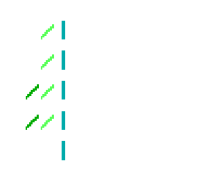

<p align="center">

</p>
<h2 align="center">Little Cedar Group Inference Recipes for NVIDIA DGX Spark</h2>
<p align="center">
   <a href="https://spark-arena.com"></a>  
   <a href="https://github.com/spark-arena/sparkrun"></a>
   <a href="https://sparkrun.dev"></a>

[//]: # (  <a href="https://recipes.sparkrun.dev"></a>)
</p>

---

This is the **Little Cedar Group recipe registry** for [sparkrun](https://github.com/spark-arena/sparkrun) from
the [Little Cedar Group][littlecedar] team.

Our recipes are run with the `@littlecedar` prefix:

```bash
sparkrun run @littlecedar/our-awesome-recipe
```

### Recipe format

Recipes follow the standard sparkrun recipe schema with some additional metadata and formatting divergences (we use YAML `>` instead of `|` for readability and resilience). See
the [recipe authoring docs](https://sparkrun.dev/recipes/format/) for the full specification.

## Run Official Recipes

```bash
# List available recipes
sparkrun list @littlecedar

# Run a recipe
sparkrun run @littlecedar/our-awesome-recipe

# Check VRAM requirements before launching
sparkrun show @littlecedar/our-awesome-recipe
# or
sparkrun recipe vram @littlecedar/our-awesome-recipe
```

## Links

- [Little Cedar Group][littlecedar] — resilience-focused technology
- [Spark Arena](https://spark-arena.com) — community benchmarking hub
- [sparkrun](https://github.com/spark-arena/sparkrun) — the tool that runs recipes
- [sparkrun docs](https://sparkrun.dev) — full documentation

[//]: # (- [Recipe Explorer]&#40;https://recipes.sparkrun.dev&#41; — browse and filter all recipes)

[littlecedar]: https://littlecedar.net