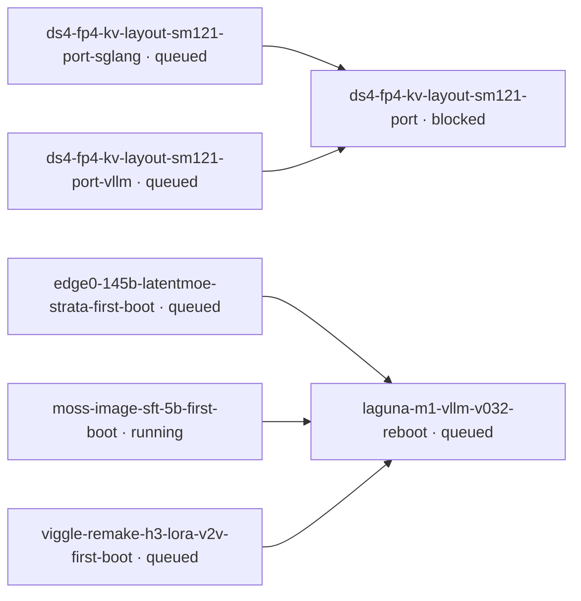

# Board — generated 2026-11-22 05:00 ET

## In flight
| where | owner | what |
|---|---|---|
| census | read-only in tick — booted nothing, claimed nothing, stopped nothing, evicted nothing | read `2026-11-22T10:00:01Z`–`2026-11-22T10:00:03Z` (each node's own `date -u`) on the base census `2026-11-22T09:01:26Z`, **0 h 58 min 35 s** after it: **5 containers, 0 volumes** fleet-wide; **research rank** on `.30`; the fenced hosts hold running containers on `.31`, `.32`, `.33`, `.34`, excluded from research accounting; `/v1/models` **200**, `/health` **200** on `.30`; `/v1/models` **200**, `/health` **200** on `.31` |
| pool | — (nobody drives it; head units re-proved each tick) | head: `beegfs-mgmtd` **active** (Result success, NRestarts 0, **+0** on the base) · `beegfs-meta` **active** (Result success, NRestarts 0, **+0** on the base) · `beegfs-storage` **active** (Result success, NRestarts 0, **+0** on the base); worker unit states and the pool's through-mount reads are not part of this census |
| queue | register snapshot `92dadfa2…`; both blocks below rendered from it | `mad-science/queue.json` sha256 **`92dadfa24d1d1981481fbf2061428e8c657f893d9292926d04fe87829178315e`** read locally: **228 tasks: 200 done, 25 queued, 2 blocked, 1 running — 28 open**; the head clone reads **`92dadfa2…`**, identical |
| window | **no manual lock** at this read | `.local/fleet-window.lock` is **absent** on the head (read `2026-11-22T10:00:04Z`) |
| campaign | `sparkrun-campaign` — active, no lease | head user unit `sparkrun-campaign` reads **`active`** / **`running`** (`MainPID` **3,930,275**, `NRestarts` **0**, **+0** on the base); the lease ledger holds **0 lease(s)** and fence(s) `tp-le2-20261120` |
| lease | **1 fence(s), 0 lease(s)** | the head's repo ledger `.local/fleet-leases.json` (389 B, sha **`ec09509d…`**, mtime **`2026-11-21 03:04:12.907935197 -0500`** local) holds fence **`tp-le2-20261120`** on `.31`, `.32`, `.33`, `.34` (`fenced_at` `2026-11-20T07:25:27Z`, owner directive 2026-11-20: production serve protected, serve `58cddf1c62ba6578_b8865cad5863` / image `986795bcd7f4`) and **0 lease(s)** |
| publication | tick | fresh census (`2026-11-22T10:00:01Z`–`2026-11-22T10:00:03Z`) written to `2026-11-22T100000Z.json` and composed on the base census `2026-11-22T09:01:26Z`; the queue blocks are rendered from `mad-science/queue.json` sha **`92dadfa2…`**, and the landed rows from `git log --since=2026-11-22T09:01:26Z` |
| .30 | **live containers** — 1 running, research accounting | `2026-11-22T10:00:01Z` (`spark-41e1`): `docker ps -aq` **1**, running **1**, volumes **0**, `:8000` listeners **1**, `/v1/models` **200**, `/health` **200** root **1,271,388,696,576 B avail** (-945,766,400, fell) · **2,555,642,122,240 B used** (+945,766,400, rose) boot **`2026-11-19T20:06:40Z`** (`btime`), `uptime` **222,801 s** `MemTotal` **127,598,704 kB** (+0), `MemAvailable` **89,504,220 kB** (+27,339,328), `Cached` **33,192,792 kB** (-21,822,312), `AnonPages` **2,463,592 kB** (-3,184,140) ring **256** events all-types (+0), **0** in-window lifecycle and **184** in-window `exec`, oldest `2026-11-22T04:37:42.229236752-05:00 container exec_die a4be8`, newest `2026-11-22T04:58:12.299184989-05:00 container destroy 024ca8` |
| .31 | **fenced serve** — excluded from the research census | `2026-11-22T10:00:01Z` (`spark-d325`): `docker ps -aq` **1**, running **1**, volumes **0**, `:8000` listeners **2**, `/v1/models` **200**, `/health` **200** root **1,559,449,153,536 B avail** (-4,546,560, fell) · **2,267,581,665,280 B used** (+4,546,560, rose) boot **`2026-11-19T20:11:15Z`** (`btime`), `uptime` **222,526 s** `MemTotal` **127,598,700 kB** (+0), `MemAvailable` **9,222,544 kB** (-40,980), `Cached` **9,569,792 kB** (+476,996), `AnonPages` **6,251,044 kB** (+63,376) ring **256** events all-types (+0), **0** in-window lifecycle and **0** in-window `exec`, oldest `2026-11-22T01:22:20.316343646-05:00 container exec_create: t`, newest `2026-11-22T02:03:50.216539739-05:00 container exec_die d9d79` |
| .32 | **fenced serve** — excluded from the research census | `2026-11-22T10:00:02Z` (`spark-ec1d`): `docker ps -aq` **1**, running **1**, volumes **0**, `:8000` listeners **0** root **1,625,073,942,528 B avail** (-12,595,200, fell) · **2,201,956,761,600 B used** (+12,595,200, rose) boot **`2026-11-19T20:14:21Z`** (`btime`), `uptime` **222,340 s** `MemTotal` **127,598,640 kB** (+0), `MemAvailable` **11,748,916 kB** (-16,572), `Cached` **12,442,076 kB** (+109,496), `AnonPages` **5,288,620 kB** (-15,596) ring **256** events all-types (+0), **0** in-window lifecycle and **0** in-window `exec`, oldest `2026-11-22T01:21:20.669666082-05:00 container exec_die 7641b`, newest `2026-11-22T02:03:50.609980136-05:00 container exec_die 7641b` |
| .33 | **fenced serve** — excluded from the research census | `2026-11-22T10:00:02Z` (`spark-3578`): `docker ps -aq` **1**, running **1**, volumes **0**, `:8000` listeners **0** root **1,521,649,287,168 B avail** (-12,640,256, fell) · **2,305,381,416,960 B used** (+12,640,256, rose) boot **`2026-11-19T20:12:55Z`** (`btime`), `uptime` **222,427 s** `MemTotal` **127,598,636 kB** (+0), `MemAvailable` **11,750,096 kB** (+26,428), `Cached` **11,975,484 kB** (+209,964), `AnonPages` **5,288,816 kB** (-4,820) ring **256** events all-types (+0), **0** in-window lifecycle and **0** in-window `exec`, oldest `2026-11-22T01:21:21.059279363-05:00 container exec_die d98d0`, newest `2026-11-22T02:03:50.958560605-05:00 container exec_die d98d0` |
| .34 | **fenced serve** — excluded from the research census | `2026-11-22T10:00:03Z` (`spark-324e`): `docker ps -aq` **1**, running **1**, volumes **0**, `:8000` listeners **0** root **1,107,041,730,560 B avail** (-12,603,392, fell) · **2,719,989,088,256 B used** (+12,603,392, rose) boot **`2026-11-19T20:09:04Z`** (`btime`), `uptime` **222,659 s** `MemTotal` **127,598,704 kB** (+0), `MemAvailable` **11,723,896 kB** (-2,408), `Cached` **12,110,828 kB** (-145,120), `AnonPages` **5,283,548 kB** (-4,748) ring **256** events all-types (+0), **0** in-window lifecycle and **0** in-window `exec`, oldest `2026-11-22T01:21:21.472607032-05:00 container exec_die ff75e`, newest `2026-11-22T02:03:51.331148782-05:00 container exec_die ff75e` |
| .35 | **nothing live (no reservation)** — idle | `2026-11-22T10:00:03Z` (`spark-383f`): `docker ps -aq` **0**, running **0**, volumes **0**, `:8000` listeners **0** root **1,042,544,840,704 B avail** (+60,899,328, rose) · **2,784,485,978,112 B used** (-60,899,328, fell) boot **`2026-11-19T20:07:56Z`** (`btime`), `uptime` **222,726 s** `MemTotal` **127,598,700 kB** (+0), `MemAvailable` **123,238,280 kB** (+242,396), `Cached` **11,088,424 kB** (-36,694,048), `AnonPages` **250,396 kB** (-4,024) ring **256** events all-types (+0), **0** in-window lifecycle and **12** in-window `exec`, oldest `2026-11-22T02:11:39.655384404-05:00 container exec_start: mk`, newest `2026-11-22T04:59:39.073048739-05:00 container destroy 3dda32` |

## Work queue

```mermaid
flowchart LR
  %% 2 blocked, 5 edges, 1 prose-gated, 0 question-gated, 0 question, 21 rows not drawn (--all)
  t1["ds4-fp4-kv-layout-sm121-port · blocked"]
  t2["ds4-fp4-kv-layout-sm121-port-sglang · queued"]
  t3["ds4-fp4-kv-layout-sm121-port-vllm · queued"]
  t4["edge0-145b-latentmoe-strata-first-boot · queued"]
  t5["laguna-m1-vllm-v032-reboot · queued"]
  t6["moss-image-sft-5b-first-boot · running"]
  t7["viggle-remake-h3-lora-v2v-first-boot · queued"]
  t2 --> t1
  t3 --> t1
  t4 --> t5
  t6 --> t5
  t7 --> t5
  classDef no-recorded-edge stroke-dasharray: 4 3
```

| job | node cost | blockers | holds | status | summary |
|---|---|---|---|---|---|
| `ds4-fp4-kv-layout-sm121-port-vllm` — DS4 1017 SM121 vLLM: carry nvfp4_ds_mla through the SM12x sparse-MLA backend so fp4 KV is selectable | single | — | ds4-fp4-kv-layout-sm121-port | queued | Queued engine work: upstream vLLM already ships nvfp4_ds_mla at 352 B/token against fp8 packed 976; the gap is the SM120 sparse-MLA backend selecting it on GB10, patched in the fork overlay, then the parent TP4 boot. |
| `ds4-fp4-kv-layout-sm121-port-sglang` — DS4 1017 SM121 SGLang: port the V41_FP4 KV layout and the fp4 pool-sizing term so fp4 KV is admissible | single | — | ds4-fp4-kv-layout-sm121-port | queued | Queued engine work: three SGLang edits at image commit 103ad321 (relax the is_sm100 gate, port the V41_FP4 layout, size the pool in fp4 bytes) so fp4 KV is admissible; a numerics gate before the parent TP4 boot. |
| `moss-image-sft-5b-first-boot` — First boot the vendor MOSS-Image-SFT arm on the Kromoss launcher and record one image cell | single | — | laguna-m1-vllm-v032-reboot | running | — Authored 2026-11-22, NOT booted (recipes/media/README.md:517-540, table row :118); staging of the 27.23 GB body is to follow. OpenMOSS-Team/MOSS-Image-SFT pinned f972bd4b..., Apache-2.0 with no banner, no revenue threshold and no non-commer… (full note: queue.json) — evidence: `head:~/benchmarks/campaign-20261122/moss-image-sft-5b-first-boot/error2.txt` |
| `edge0-145b-latentmoe-strata-first-boot` — First boot the Edge0-145B NVFP4 strata arm: in-container source build, then one cell | single | — | laguna-m1-vllm-v032-reboot | queued | — HOST PIN (owner 2026-11-22): boot on .35 ONLY -- .30 is the BeeGFS metadata server and a 106 GiB boot there risks a metadata incident, and .31-.34 carry the fenced production serve. The pin is enforced through this row's exclude_hosts (all … (full note: queue.json) — evidence: `head:~/benchmarks/campaign-20261122/edge0-145b-latentmoe-strata-first-boot/failure.log` |
| `viggle-remake-h3-lora-v2v-first-boot` — Boot the Viggle-Remake H3 LoRA v2v ComfyUI arm once its 156 GiB staging lands | single | — | laguna-m1-vllm-v032-reboot | queued | Queued after staging landed (156.06 GiB at 7e5be143): the boot died 81 s into the stage because the mod does not clear sparkrun HF_HUB_OFFLINE=1 for its own fetch, the LTX arm documented fix; nothing measured. |
| `beegfs-meta-restart-loop-non-meta-hosts` — beegfs-meta restart-loops every 5 s on .31-.35, and the loop hides a failed state behind "activating" | single | — | — | blocked | Blocked, owner 2026-11-22: the OOM drop-in Restart=on-failure loops beegfs-meta every 5 s on .31-.35 (NRestarts 3431, 956.6 MB journal) while is-active reads activating; remedy is masking the unit there, .30 untouched. |
| `head-clone-object-store-incomplete` — The head clone loses git objects continuously (healed twice on 2026-11-21, gap reopens on every new commit), so `git ls-tree HEAD` and any `git pull` fail there until it is re-healed | — | — | — | queued | Head clone loses loose objects (packs agree) so git reads fail there; healed twice on 2026-11-21 (91 objects), yet the gap reopens on every commit and one 743 B tree never syncs, so the mechanism is unnamed. |
| `hf-cache-20261110-docs-only-repin-bundle` — Docs-only model drift from the 2026-11-10 cache update: 22 recipe rows across 10 repos ride their lane’s next boot (no boot of its own) | — | — | — | queued | Docs-only drift bundle over 14 live recipe rows (8 of the 22 retired to attic): only README/LICENSE/eval_results differ from the head, no pin bumped since the sweep, each lane moves its pin at its next boot and records it. |
| `house-num-scorer-trailing-period` — House battery scores a correct number with a trailing period as a miss | — | — | — | queued | score() for kind=num keeps the sentence-final dot, so a correct 74 ending a sentence scores false (Ripple 2026-11-20 hard-arith-1); fix is stripping trailing punctuation plus a regression test over 74, 74. and 7.5. |
| `house-scores-reasoning-only-as-empty` — House battery scores a reasoning-only reply as empty — Sage trick-1 is a reasoning loop, not a serve event | — | — | — | queued | Queued: quality-battery chat() reads only message.content, so a reasoning-only reply (Sage-A1.5 empty content, 16-30k reasoning chars, finish_reason=length, 4/4 reproduced) scores as dead; fix records finish_reason. |
| `queue-mode-done-sibling-holds-canary-row` — Queue mode will not lease a row whose recipe a done sibling already holds | — | — | — | queued | Canary row (tp4 quartet recipe) never leases because plan.sibling_hold keys arms on the recipe stem and done sibling h2h-second-boot-ds4-1017 holds it, fleet idle meanwhile; open choice: close sibling, own recipe file, or change the hold. |
| `campaign-ingest-freezes-on-an-unplaceable-pending-arm` — The campaign never re-reads the register while any arm is pending, so one unplaceable pending arm silently stops new rows from ever being seen | — | — | — | queued | Campaign refreshes only when drained; a pending memory-risky TP4 arm that cannot fit .30/.35 with .31-.34 fenced holds drained() false, so rows queued after 00:12 were never ingested; fix: idle-poll refresh or unplaceable state. |
| `campaign-leases-tp4-onto-30` — The campaign leases memory-heavy TP4 quartets onto .30, which the owner ruling excludes | quartet | — | — | queued | Lease ledger and holder/id claim identity landed offline (d0cf704, no live director-driven TP4 lease yet); .30 is waivable for a memory-heavy quartet only inside a declared window with the six guardrails, else refused. Row open. |
| `campaign-state-copy-re-nests` — The director's receipts root copies state.json back into a window subdir, so one campaign now holds 40 nested copies | — | — | — | queued | One campaign holds 40 byte-identical nested state.json copies because --receipts-root equals --root, so each run under tp12-window re-nests; no stale state is read today, but a **/state.json census counted 49 files for 9 campaigns. |
| `mem-guard-outlives-its-task` — A window arm's 6.0 GiB stop-rule guard outlives the arm, so the runner accumulates guards for tasks whose containers are gone | — | — | — | queued | Corrected: a leaked guard is a stale no-op because mem-guard stops only its own task id; what accumulates is processes and ssh sessions — three guards alive on 2026-11-10 with one task container; fix is guard lifetime and harness refusal. |
| `watchdog-stall-mmap-flat-residual` — Watchdog stall rule: mmap load with flat io/log and sub-128-MiB memory progress | — | — | — | queued | boot-watchdog counts memory as progress only past a 128 MiB floor, so an mmap load with flat io/log and smaller per-check deltas is still classified stalled at 600 s; fix is cumulative progress or a test plus a recorded risk. |
| `board-publish-accepts-weaker-replacement` — publish replaces a better-grounded In-flight composition with a fresher byte-compatible one, and no guard notices | — | — | — | queued | Publish guards compare bytes, so a replacement with fewer facts passes: on 2026-11-11 a composition replaced the peer's 4 captures ending 01:16 with 3 ending 01:06; acceptance is a pre-publish check on capture count, state labels, teardown. |
| `board-publish-keeps-in-flight-row-set` — A board published without one of the In-flight state rows passes every guard, because publish compares bytes and never the row set | — | — | — | queued | A base missing an In-flight state row is indistinguishable from a good one: bc2cc38 published 0 queue rows and passed publish, lint and the gate; acceptance: refuse an In-flight lacking an expected row key or a strict subset of its base. |
| `cache-audit-pool-budget` — `tools/cache-audit.py --budget-gb`: add a pool mode that judges the one shared HF pool against 90 % of capacity | — | — | — | queued | cache-audit --budget-gb measures per node but the HF cache is one shared pool, so every node reads the same and the fleet flags at once; it needs a pool mode judging usage against 90% of capacity with one pass/fail. Not bootable. |
| `executor-release-host-claim-on-failure` — An executor that stops observing a launch must release the sparkrun host claims it holds | — | — | — | queued | A launcher that stops observing its boot still holds sparkrun host claims: pid 1883449 held .30-.33 after a 414.7 s registry failure, the next three arms refused rc=5; unfixed at 4927a7fe — nothing kills the launcher to drop the claim. |
| `fleet-boot-without-lease-record` — A four-rank boot serves with no lease in either ledger and no window lock | — | — | — | queued | Corrected: the unleased four-rank serve measured on 2026-11-11 is the shipped production arm (image digest and argv match), not a research quartet; open is whether a protected production boot must carry a lease under the S9 answer. |
| `laguna-m1-vllm-v032-reboot` — Re-boot Laguna-M.1 on vLLM v0.32.0 and replace its v0.29.0 measurements | pair | daisyrose-27b-bf16-thinking-first-boot, edge0-145b-latentmoe-strata-first-boot, inworld-voice-isolator-first-boot, lane-survey-edge0-audio8-tts, minimax-h3-fl2va-t2va-first-boot, moss-image-sft-5b-first-boot, ornith-122b-nospec-noparsers-boot, ornith-122b-nospec-rawchat-boot, ornith-122b-nvfp4-uncensored-dflash2-first-boot, qwen38-27b-pi-lora-probe-boot, viggle-remake-h3-lora-v2v-first-boot, webai-twil-8b-eval-only-arm | — | queued | Queued, ordered last: the CVE bump to v0.32.0 was never re-booted, so TTR, KV pool and suite numbers are still v0.29.0; acceptance is a boot on the pinned digest, BUMPED removed, and the reasoning-token trap settled. |
| `sparkrun-single-gid-index-for-two-hcas` — sparkrun injects one GID index across two HCAs whose tables disagree | — | — | — | queued | Report-only sparkrun defect: one derived NCCL_IB_GID_INDEX is applied to both HCAs, and a 2026-11-11 carrier flap vacated plane A's index 3, failing ncclCommInitRank (ibv_modify_qp 61) on boot 2 and the control; fix per HCA or fail closed. |
| `window-lock-does-not-stop-direct-boots` — A declared window holds campaign placement and `director lease`, but a direct `sparkrun run` boot bypasses both | — | — | — | queued | A declared window stops campaign placement and lease but not a direct sparkrun run: inside the 01:04-01:16 window a solo container started on .35 with no lease record and no assign line; decide whether direct boots consult the lock. |
| `inkling-tp4-first-boot` — Inkling-2-Small TP=4 first boot: nightly pull and the unproven sm_121 Triton path | quartet | — | — | queued | Inkling-2-Small TP4 first boot: nightly digest c17e9d88 is on no node so the boot includes the pull, and sm_121 runs the Hopper/Triton path (attention_sm90, Humming expert GEMMs) unproven here; needs an owner-declared window. |
| `mech-cites-0-4-3` — Re-derive the remaining 117 recipes/MECHANICS.md citations against the installed sparkrun build | — | — | — | queued | 117 recipes/MECHANICS.md anchors still carry 0.4.2/0.4.0 numbering after d0d050f landed 27 plus 13 controls; not mechanically renumberable since core/recipe.py grew to 3080 lines, so each sentence is re-read and its claim re-located. |
| `weightless-dsgb10-tp4-boot-gate` — Boot the weightless-dsgb10 arm four-rank: the α=0 golden hash must equal stock bit-for-bit before any steered request is quoted | quartet | — | — | queued | Boot gate, weightless image: at α=0 output must be byte-identical to stock before any steered request is quoted, then a second-name request must project while a stock one keeps its text; four ranks, .31-.34 unfenced, --cluster WOPR. |
| `ds4-fp4-kv-layout-sm121-port` — DS4 1017 SM121: port the V41/V41_FP4 KV layout so fp4 KV is admissible — dtype is not a lever today, and sizing lies about fp4 | quartet | ds4-fp4-kv-layout-sm121-port-sglang, ds4-fp4-kv-layout-sm121-port-vllm | — | blocked | Blocked on engine work: fp4 KV needs the is_sm100 gate relaxed, the V41/V41_FP4 layout ported and an fp4 branch in the pool configurator, and nvfp4 is unsafe today because sizing has no fp4 term; it buys 2-4x tokens per GiB but no floor. |

## Landed session
Window: commits since `2026-11-22T09:01:26Z` — the base census stamp, later than the 24 h start `2026-11-21T10:00:00Z`; older rows are not shown.

| time ET | commit | one clause |
|---|---|---|
| 11-22 04:01 | `084a14a6` | Refresh the status board: a 2026-11-22T090126Z census |
| 11-22 04:03 | `bc7ef372` | Give five register rows a board summary that matches their drain outcomes |
| 11-22 04:16 | `1cd3ff11` | Close the voice isolator and return the LoRA probe with its measurement |
| 11-22 04:30 | `be66ae5a` | Correct the LoRA selector contract the probe tripped over |
| 11-22 04:31 | `b5713ad9` | Correct the probe arm's served-id row to the real LoRA selector |
| 11-22 04:32 | `afeea5d2` | Fix the viggle stage's offline fetch and the MOSS pipeline identity |
| 11-22 04:48 | `26030a86` | Close TwIL and the LoRA probe, and return Edge0 with its apt finding |
