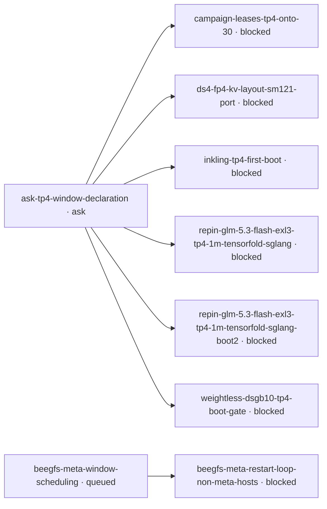

# Board
_Generated 2026-11-22 20:36 ET_

## In flight
| where | owner | what |
|---|---|---|
| census | read-only in tick — booted nothing, claimed nothing, stopped nothing, evicted nothing | read `2026-11-23T01:36:39Z`–`2026-11-23T01:36:42Z` (each node's own `date -u`) on the base census `2026-11-23T01:24:44Z`, **0 h 11 min 55 s** after it: **6 containers, 0 volumes** fleet-wide; **research rank** on `.30`, `.35`; the fenced hosts hold running containers on `.31`, `.32`, `.33`, `.34`, excluded from research accounting; `/v1/models` **200**, `/health` **200** on `.30`; `/v1/models` **200**, `/health` **200** on `.31`; `/v1/models` **200**, `/health` **200** on `.35` |
| pool | — (nobody drives it; head units re-proved each tick) | head: `beegfs-mgmtd` **active** (Result success, NRestarts 0, **+0** on the base) · `beegfs-meta` **active** (Result success, NRestarts 0, **+0** on the base) · `beegfs-storage` **active** (Result success, NRestarts 0, **+0** on the base); worker unit states and the pool's through-mount reads are not part of this census |
| queue | register snapshot `f7c8d44b…`; both blocks below rendered from it | `origin/main:mad-science/queue.json` sha256 **`f7c8d44b03f4332010df4f4acc7c46382a1726d793f148cd0dac2491f46be1e9`** read locally: **253 tasks: 231 done, 11 queued, 7 blocked, 2 running, 2 ask — 22 open**; the head clone reads **`d3ce705a…`**, **differs** |
| window | **no manual lock** at this read | `.local/fleet-window.lock` is **absent** on the head (read `2026-11-23T01:36:43Z`) |
| campaign | `sparkrun-campaign` — active, no lease | head user unit `sparkrun-campaign` reads **`active`** / **`running`** (`MainPID` **3,930,275**, `NRestarts` **0**, **+0** on the base); the lease ledger holds **0 lease(s)** and fence(s) `tp-le2-20261120` |
| lease | **1 fence(s), 0 lease(s)** | the head's repo ledger `.local/fleet-leases.json` (389 B, sha **`ec09509d…`**, mtime **`2026-11-21 03:04:12.907935197 -0500`** local) holds fence **`tp-le2-20261120`** on `.31`, `.32`, `.33`, `.34` (`fenced_at` `2026-11-20T07:25:27Z`, owner directive 2026-11-20: production serve protected, serve `58cddf1c62ba6578_b8865cad5863` / image `986795bcd7f4`) and **0 lease(s)** |
| publication | tick | fresh census (`2026-11-23T01:36:39Z`–`2026-11-23T01:36:42Z`) written to `2026-11-23T013638Z.json` and composed on the base census `2026-11-23T01:24:44Z`; the queue blocks are rendered from `origin/main:mad-science/queue.json` sha **`f7c8d44b…`**, and the landed rows from `git log --since=2026-11-23T01:24:44Z` |
| .30 | **live containers** — 1 running, research accounting | `2026-11-23T01:36:39Z` (`spark-41e1`): `docker ps -aq` **1**, running **1**, volumes **0**, `:8000` listeners **1**, `/v1/models` **200**, `/health` **200** root **1,215,175,610,368 B avail** (-108,421,120, fell) · **2,611,855,208,448 B used** (+108,421,120, rose) boot **`2026-11-19T20:06:40Z`** (`btime`), `uptime` **278,999 s** `MemTotal` **127,598,704 kB** (+0), `MemAvailable` **19,464,068 kB** (+87,400), `Cached` **14,556,244 kB** (+117,352), `AnonPages` **7,387,140 kB** (-17,320) ring **256** events all-types (+0), **0** in-window lifecycle and **72** in-window `exec`, oldest `2026-11-22T20:07:36.871554230-05:00 container exec_start: sh`, newest `2026-11-22T20:36:20.649334779-05:00 container exec_die a98a3` |
| .31 | **fenced serve** — excluded from the research census | `2026-11-23T01:36:41Z` (`spark-d325`): `docker ps -aq` **1**, running **1**, volumes **0**, `:8000` listeners **2**, `/v1/models` **200**, `/health` **200** root **1,559,398,346,752 B avail** (+72,200,192, rose) · **2,267,632,472,064 B used** (-72,200,192, fell) boot **`2026-11-19T20:11:15Z`** (`btime`), `uptime` **278,725 s** `MemTotal` **127,598,700 kB** (+0), `MemAvailable` **8,824,352 kB** (+27,476), `Cached` **5,871,904 kB** (+12,312), `AnonPages` **6,612,220 kB** (+6,464) ring **256** events all-types (+0), **0** in-window lifecycle and **72** in-window `exec`, oldest `2026-11-22T19:54:18.938786687-05:00 container exec_start: ta`, newest `2026-11-22T20:36:18.879566683-05:00 container exec_die d9d79` |
| .32 | **fenced serve** — excluded from the research census | `2026-11-23T01:36:41Z` (`spark-ec1d`): `docker ps -aq` **1**, running **1**, volumes **0**, `:8000` listeners **0** root **1,624,954,597,376 B avail** (-1,200,128, fell) · **2,202,076,106,752 B used** (+1,200,128, rose) boot **`2026-11-19T20:14:21Z`** (`btime`), `uptime` **278,539 s** `MemTotal` **127,598,640 kB** (+0), `MemAvailable` **11,663,284 kB** (+44,820), `Cached` **10,037,328 kB** (+5,384), `AnonPages` **5,317,900 kB** (+5,384) ring **256** events all-types (+0), **0** in-window lifecycle and **72** in-window `exec`, oldest `2026-11-22T19:53:49.159049023-05:00 container exec_die 7641b`, newest `2026-11-22T20:36:19.277727821-05:00 container exec_die 7641b` |
| .33 | **fenced serve** — excluded from the research census | `2026-11-23T01:36:42Z` (`spark-3578`): `docker ps -aq` **1**, running **1**, volumes **0**, `:8000` listeners **0** root **1,521,529,823,232 B avail** (-1,196,032, fell) · **2,305,500,880,896 B used** (+1,196,032, rose) boot **`2026-11-19T20:12:55Z`** (`btime`), `uptime` **278,626 s** `MemTotal` **127,598,636 kB** (+0), `MemAvailable` **11,689,868 kB** (+29,560), `Cached` **10,411,908 kB** (+5,656), `AnonPages` **5,318,768 kB** (+2,276) ring **256** events all-types (+0), **0** in-window lifecycle and **72** in-window `exec`, oldest `2026-11-22T19:53:49.533590219-05:00 container exec_die d98d0`, newest `2026-11-22T20:36:19.693685606-05:00 container exec_die d98d0` |
| .34 | **fenced serve** — excluded from the research census | `2026-11-23T01:36:42Z` (`spark-324e`): `docker ps -aq` **1**, running **1**, volumes **0**, `:8000` listeners **0** root **1,106,922,229,760 B avail** (-1,200,128, fell) · **2,720,108,589,056 B used** (+1,200,128, rose) boot **`2026-11-19T20:09:04Z`** (`btime`), `uptime` **278,858 s** `MemTotal` **127,598,704 kB** (+0), `MemAvailable` **11,648,780 kB** (-37,992), `Cached` **11,352,984 kB** (+5,376), `AnonPages` **5,301,768 kB** (-7,420) ring **256** events all-types (+0), **0** in-window lifecycle and **72** in-window `exec`, oldest `2026-11-22T19:53:49.904756401-05:00 container exec_die ff75e`, newest `2026-11-22T20:36:20.118758056-05:00 container exec_die ff75e` |
| .35 | **live containers** — 1 running, research accounting | `2026-11-23T01:36:42Z` (`spark-383f`): `docker ps -aq` **1**, running **1**, volumes **0**, `:8000` listeners **1**, `/v1/models` **200**, `/health` **200** root **1,041,207,881,728 B avail** (-9,474,048, fell) · **2,785,822,937,088 B used** (+9,474,048, rose) boot **`2026-11-19T20:07:56Z`** (`btime`), `uptime` **278,926 s** `MemTotal` **127,598,700 kB** (+0), `MemAvailable` **11,749,416 kB** (+130,752), `Cached` **4,702,412 kB** (+17,928), `AnonPages` **4,692,904 kB** (-106,416) ring **256** events all-types (+0), **0** in-window lifecycle and **72** in-window `exec`, oldest `2026-11-22T20:10:10.899162391-05:00 container exec_start: ta`, newest `2026-11-22T20:36:20.585385210-05:00 container exec_die 3ede3` |

## Work Queue

```mermaid
flowchart LR
  %% 7 blocked, 7 edges, 0 prose-gated, 13 rows not drawn (--all)
  t1["ask-tp4-window-declaration · ask"]
  t2["beegfs-meta-restart-loop-non-meta-hosts · blocked"]
  t3["beegfs-meta-window-scheduling · queued"]
  t4["campaign-leases-tp4-onto-30 · blocked"]
  t5["ds4-fp4-kv-layout-sm121-port · blocked"]
  t6["inkling-tp4-first-boot · blocked"]
  t7["repin-glm-5.3-flash-exl3-tp4-1m-tensorfold-sglang · blocked"]
  t8["repin-glm-5.3-flash-exl3-tp4-1m-tensorfold-sglang-boot2 · blocked"]
  t9["weightless-dsgb10-tp4-boot-gate · blocked"]
  t1 --> t4
  t1 --> t5
  t1 --> t6
  t1 --> t7
  t1 --> t8
  t1 --> t9
  t3 --> t2
  classDef no-recorded-edge stroke-dasharray: 4 3
```

| job | node cost | blockers | holds | status | summary |
|---|---|---|---|---|---|
| `ask-tp4-window-declaration` — Ask: declare the four-rank TP4 window that two blocked quartet boots wait on | — | — | weightless-dsgb10-tp4-boot-gate, inkling-tp4-first-boot, campaign-leases-tp4-onto-30, repin-glm-5.3-flash-exl3-tp4-1m-tensorfold-sglang, repin-glm-5.3-flash-exl3-tp4-1m-tensorfold-sglang-boot2, ds4-fp4-kv-layout-sm121-port | ask | — QUESTION FOR THE OWNER: when may a four-rank TP4 boot run? Two arms are otherwise ready — weightless-dsgb10-tp4-boot-gate (the alpha=0 golden hash must equal stock before any steered request is quoted) and inkling-tp4-first-boot (first boot… (full note: queue.json) |
| `beegfs-meta-window-scheduling` — Propose and declare the maintenance window for the beegfs-meta fix | — | — | beegfs-meta-restart-loop-non-meta-hosts | queued | — OWNER ANSWER 2026-11-22 (ViBoard thread t22): the beegfs-meta restart-loop fix is deferred — its own session, no window yet. This row is the step that makes a window possible without pushing one: propose one or two candidate maintenance win… (full note: queue.json) |
| `ask-vllm-nvfp4-abi` — Ask: adopt FlashInfer's 384-byte nvfp4 ABI for the vLLM path, or build a 352-byte SM12x reader? | — | — | ds4-fp4-kv-layout-sm121-port-vllm | ask | — QUESTION FOR THE OWNER: does the vLLM fp4-KV path adopt FlashInfer's 384-byte nvfp4 ABI, or does someone build a 352-byte SM12x reader? The layout half is delivered (fork overlay patch/nvfp4-ds-mla/, local 0b5c1a8: the 352-byte record = 448… (full note: queue.json) |
| `beegfs-meta-restart-loop-non-meta-hosts` — beegfs-meta restart-loops every 5 s on .31-.35, and the loop hides a failed state behind "activating" | single | ask-beegfs-meta-window, beegfs-meta-window-scheduling | — | blocked | — Measured 2026-11-09 07:03-07:05 ET, and it is the side effect of the fix beegfs-units-restart-no (done) blessed: /etc/systemd/system/beegfs-meta.service.d/oom.conf (mtime 2026-11-08 16:03 on .30, 16:05 on .31) sets OOMScoreAdjust plus Resta… (full note: queue.json) — evidence: `.scratch/infra-chores-20261122/beegfs-meta/RECEIPT.md` |
| `repin-clef-flash-decision-sglang` — Boot clef-flash-decision-sglang with the refreshed pin and move its pins | single | — | — | queued | — PIN MOVE 2026-11-22 (owner rule, ViBoard thread t24): updated pins are boot-tested as soon as a window of the correct size is free for them, and the pin moves in that boot's commit — no carrier-lane ride-along. This row boots recipes/decisi… (full note: queue.json) |
| `repin-glm-5.3-flash-exl3-tp4-1m-tensorfold-sglang` — Boot glm-5.3-flash-exl3-tp4-1m-tensorfold-sglang with the refreshed pin and move its pins | quartet | ask-tp4-window-declaration | — | blocked | — PIN MOVE 2026-11-22 (owner rule, ViBoard thread t24): updated pins are boot-tested as soon as a window of the correct size is free for them, and the pin moves in that boot's commit — no carrier-lane ride-along. This row boots recipes/glm/gl… (full note: queue.json) |
| `repin-glm-5.3-flash-exl3-tp4-1m-tensorfold-sglang-boot2` — Boot glm-5.3-flash-exl3-tp4-1m-tensorfold-sglang-boot2 with the refreshed pin and move its pins | quartet | ask-tp4-window-declaration | — | blocked | — PIN MOVE 2026-11-22 (owner rule, ViBoard thread t24): updated pins are boot-tested as soon as a window of the correct size is free for them, and the pin moves in that boot's commit — no carrier-lane ride-along. This row boots recipes/glm/gl… (full note: queue.json) |
| `repin-nex-n2.5-mini-uncensored-nvfp4-sglang` — Boot nex-n2.5-mini-uncensored-nvfp4-sglang with the refreshed pin and move its pins | single | — | — | queued | — PIN MOVE 2026-11-22 (owner rule, ViBoard thread t24): updated pins are boot-tested as soon as a window of the correct size is free for them, and the pin moves in that boot's commit — no carrier-lane ride-along. This row boots recipes/cybers… (full note: queue.json) |
| `repin-nex-n2.5-mini-uncensored-nvfp4-vllm` — Boot nex-n2.5-mini-uncensored-nvfp4-vllm with the refreshed pin and move its pins | single | — | — | queued | — PIN MOVE 2026-11-22 (owner rule, ViBoard thread t24): updated pins are boot-tested as soon as a window of the correct size is free for them, and the pin moves in that boot's commit — no carrier-lane ride-along. This row boots recipes/cybers… (full note: queue.json) |
| `repin-qwen3.8-27b-uncensored-nvfp4-nextn-sglang` — Boot qwen3.8-27b-uncensored-nvfp4-nextn-sglang with the refreshed pin and move its pins | single | — | — | queued | — PIN MOVE 2026-11-22 (owner rule, ViBoard thread t24): updated pins are boot-tested as soon as a window of the correct size is free for them, and the pin moves in that boot's commit — no carrier-lane ride-along. This row boots recipes/cybers… (full note: queue.json) |
| `repin-qwen3.8-27b-uncensored-nvfp4-sglang` — Boot qwen3.8-27b-uncensored-nvfp4-sglang with the refreshed pin and move its pins | single | — | — | queued | — PIN MOVE 2026-11-22 (owner rule, ViBoard thread t24): updated pins are boot-tested as soon as a window of the correct size is free for them, and the pin moves in that boot's commit — no carrier-lane ride-along. This row boots recipes/cybers… (full note: queue.json) |
| `repin-qwen3.8-flash-next-uncensored-nvfp4-sglang` — Boot qwen3.8-flash-next-uncensored-nvfp4-sglang with the refreshed pin and move its pins | pair | — | — | queued | — PIN MOVE 2026-11-22 (owner rule, ViBoard thread t24): updated pins are boot-tested as soon as a window of the correct size is free for them, and the pin moves in that boot's commit — no carrier-lane ride-along. This row boots recipes/cybers… (full note: queue.json) |
| `repin-qwen3.8-flash-next-uncensored-nvfp4-vllm` — Boot qwen3.8-flash-next-uncensored-nvfp4-vllm with the refreshed pin and move its pins | pair | — | — | queued | — PIN MOVE 2026-11-22 (owner rule, ViBoard thread t24): updated pins are boot-tested as soon as a window of the correct size is free for them, and the pin moves in that boot's commit — no carrier-lane ride-along. This row boots recipes/cybers… (full note: queue.json) |
| `repin-spark-x2.6-4b-bf16-sglang` — Boot spark-x2.6-4b-bf16-sglang with the refreshed pin and move its pins | single | — | — | running | — PIN MOVE 2026-11-22 (owner rule, ViBoard thread t24): updated pins are boot-tested as soon as a window of the correct size is free for them, and the pin moves in that boot's commit — no carrier-lane ride-along. This row boots recipes/explor… (full note: queue.json) |
| `repin-spark-x2.6-4b-fp8-sglang` — Boot spark-x2.6-4b-fp8-sglang with the refreshed pin and move its pins | single | — | — | running | — PIN MOVE 2026-11-22 (owner rule, ViBoard thread t24): updated pins are boot-tested as soon as a window of the correct size is free for them, and the pin moves in that boot's commit — no carrier-lane ride-along. This row boots recipes/explor… (full note: queue.json) |
| `repin-ternary-bonsai-2-9b-q2_0-llamacpp` — Boot ternary-bonsai-2-9b-q2_0-llamacpp with the refreshed pin and move its pins | single | — | — | queued | — PIN MOVE 2026-11-22 (owner rule, ViBoard thread t24): updated pins are boot-tested as soon as a window of the correct size is free for them, and the pin moves in that boot's commit — no carrier-lane ride-along. This row boots recipes/explor… (full note: queue.json) |
| `repin-zz-minimax-h3-fl2va-t2va-sglang` — Boot zz-minimax-h3-fl2va-t2va-sglang with the refreshed pin and move its pins | single | — | — | queued | — PIN MOVE 2026-11-22 (owner rule, ViBoard thread t24): updated pins are boot-tested as soon as a window of the correct size is free for them, and the pin moves in that boot's commit — no carrier-lane ride-along. This row boots recipes/media/… (full note: queue.json) |
| `repin-zz-sage-a1.5-35b-a3b-fp8-sglang` — Boot zz-sage-a1.5-35b-a3b-fp8-sglang with the refreshed pin and move its pins | single | — | — | queued | — PIN MOVE 2026-11-22 (owner rule, ViBoard thread t24): updated pins are boot-tested as soon as a window of the correct size is free for them, and the pin moves in that boot's commit — no carrier-lane ride-along. This row boots recipes/explor… (full note: queue.json) |
| `campaign-leases-tp4-onto-30` — The campaign leases memory-heavy TP4 quartets onto .30, which the owner ruling excludes | quartet | ask-placement-policy-30, ask-tp4-window-declaration | — | blocked | — MECHANISM LANDED OFFLINE 2026-11-11 (commits `aa54000`, `ebf5c8e`, `298098d`, `08ff156`; no live lease and no live six-node boot has run, so the row stays open). One ledger, `<repo>/.local/fleet-leases.json` (flock + atomic write), and one … (full note: queue.json) |
| `inkling-tp4-first-boot` — Inkling-2-Small TP=4 first boot: nightly pull and the unproven sm_121 Triton path | quartet | ask-tp4-window-declaration | — | blocked | — No node holds the pinned nightly digest c17e9d88, so the first boot includes the pull. GB10 is sm_121 and the Blackwell path gates on capability family 100, so the engine runs the Hopper/Triton half (attention_sm90 plus the Humming expert G… (full note: queue.json) — evidence: `recipes/explore/README.md section zz-inkling-2-small-nvfp4-thinking-tools-tp4-vllm` |
| `weightless-dsgb10-tp4-boot-gate` — Boot the weightless-dsgb10 arm four-rank: the α=0 golden hash must equal stock bit-for-bit before any steered request is quoted | quartet | ask-tp4-window-declaration | — | blocked | — Boot gate for the image closed by weightless-image-build-publish-pin (1bc6b5cb). Image ghcr.io/littlecedar/dgx-picom-ds41f:ds41f-7c123ad4-pr15-pr7-weightless, digest sha256:305b6e5151a2cfd13b85f18c36bccf9062af83e28917fd11a0f151691c5e83df, p… (full note: queue.json) — evidence: `recipes/ds4/zz-deepseek-v4.1-flash-1017-weightless-dsgb10-tp4.yaml (container pinned by digest at line 30); recipes/ds4/README.md lines 2890-2911 (two-name contract, alpha=0 identity) and 2990-2996 (the boot gate)` |
| `ds4-fp4-kv-layout-sm121-port` — DS4 1017 SM121: port the V41/V41_FP4 KV layout so fp4 KV is admissible — dtype is not a lever today, and sizing lies about fp4 | quartet | ask-tp4-window-declaration, ds4-fp4-kv-layout-sm121-port-sglang, ds4-fp4-kv-layout-sm121-port-vllm | — | blocked | — RECIPE RETIRED 2026-11-18: the `zz-` arm this row booted is archived at `attic/ds4/zz-ds4-1017-sm121-indexer-scoring.yaml` (it was run or refused on record; see the lane attic index), so the row is no longer bootable. CORRECTION TO THE FP8-… (full note: queue.json) |

## Completed Work
Window: commits since `2026-11-23T01:24:44Z` — the base census stamp, later than the 24 h start `2026-11-22T01:36:38Z`; older rows are not shown.

| time ET | commit | one clause |
|---|---|---|
| 11-22 20:24 | `62ee85e6` | Refresh the status board: a 2026-11-23T012443Z census |
