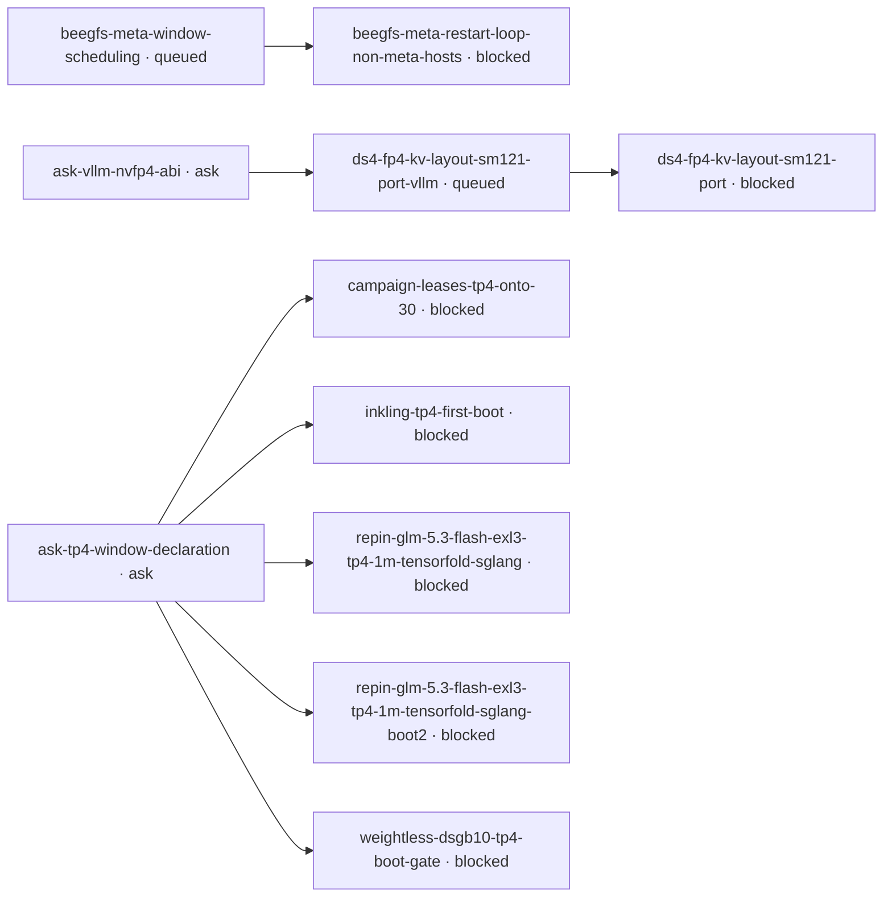

# Board
_Generated 2026-11-22 20:24 ET_

## In flight
| where | owner | what |
|---|---|---|
| census | read-only in tick — booted nothing, claimed nothing, stopped nothing, evicted nothing | read `2026-11-23T01:24:44Z`–`2026-11-23T01:24:47Z` (each node's own `date -u`) on the base census `2026-11-23T01:12:44Z`, **0 h 12 min 0 s** after it: **6 containers, 0 volumes** fleet-wide; **research rank** on `.30`, `.35`; the fenced hosts hold running containers on `.31`, `.32`, `.33`, `.34`, excluded from research accounting; `/v1/models` **200**, `/health` **200** on `.30`; `/v1/models` **200**, `/health` **200** on `.31`; `/v1/models` **200**, `/health` **200** on `.35` |
| pool | — (nobody drives it; head units re-proved each tick) | head: `beegfs-mgmtd` **active** (Result success, NRestarts 0, **+0** on the base) · `beegfs-meta` **active** (Result success, NRestarts 0, **+0** on the base) · `beegfs-storage` **active** (Result success, NRestarts 0, **+0** on the base); worker unit states and the pool's through-mount reads are not part of this census |
| queue | register snapshot `c1442168…`; both blocks below rendered from it | `origin/main:mad-science/queue.json` sha256 **`c14421683573c554053573342fdc2823b1bb8d1c5502b39e2ff1d49ee8e0d673`** read locally: **253 tasks: 230 done, 12 queued, 7 blocked, 2 running, 2 ask — 23 open**; the head clone reads **`c1442168…`**, identical |
| window | **no manual lock** at this read | `.local/fleet-window.lock` is **absent** on the head (read `2026-11-23T01:24:48Z`) |
| campaign | `sparkrun-campaign` — active, no lease | head user unit `sparkrun-campaign` reads **`active`** / **`running`** (`MainPID` **3,930,275**, `NRestarts` **0**, **+0** on the base); the lease ledger holds **0 lease(s)** and fence(s) `tp-le2-20261120` |
| lease | **1 fence(s), 0 lease(s)** | the head's repo ledger `.local/fleet-leases.json` (389 B, sha **`ec09509d…`**, mtime **`2026-11-21 03:04:12.907935197 -0500`** local) holds fence **`tp-le2-20261120`** on `.31`, `.32`, `.33`, `.34` (`fenced_at` `2026-11-20T07:25:27Z`, owner directive 2026-11-20: production serve protected, serve `58cddf1c62ba6578_b8865cad5863` / image `986795bcd7f4`) and **0 lease(s)** |
| publication | tick | fresh census (`2026-11-23T01:24:44Z`–`2026-11-23T01:24:47Z`) written to `2026-11-23T012443Z.json` and composed on the base census `2026-11-23T01:12:44Z`; the queue blocks are rendered from `origin/main:mad-science/queue.json` sha **`c1442168…`**, and the landed rows from `git log --since=2026-11-23T01:12:44Z` |
| .30 | **live containers** — 1 running, research accounting | `2026-11-23T01:24:44Z` (`spark-41e1`): `docker ps -aq` **1**, running **1**, volumes **0**, `:8000` listeners **1**, `/v1/models` **200**, `/health` **200** root **1,215,284,031,488 B avail** (-132,186,112, fell) · **2,611,746,787,328 B used** (+132,186,112, rose) boot **`2026-11-19T20:06:40Z`** (`btime`), `uptime` **278,283 s** `MemTotal` **127,598,704 kB** (+0), `MemAvailable` **19,376,668 kB** (-50,280), `Cached` **14,438,892 kB** (+1,300,672), `AnonPages` **7,404,460 kB** (+30,552) ring **256** events all-types (+0), **0** in-window lifecycle and **84** in-window `exec`, oldest `2026-11-22T20:06:14.201387338-05:00 container attach 0e642a3`, newest `2026-11-22T20:24:20.702676194-05:00 container exec_die a98a3` |
| .31 | **fenced serve** — excluded from the research census | `2026-11-23T01:24:45Z` (`spark-d325`): `docker ps -aq` **1**, running **1**, volumes **0**, `:8000` listeners **2**, `/v1/models` **200**, `/health` **200** root **1,559,326,146,560 B avail** (-9,732,096, fell) · **2,267,704,672,256 B used** (+9,732,096, rose) boot **`2026-11-19T20:11:15Z`** (`btime`), `uptime` **278,010 s** `MemTotal` **127,598,700 kB** (+0), `MemAvailable` **8,796,876 kB** (+25,536), `Cached` **5,859,592 kB** (+5,832), `AnonPages` **6,605,756 kB** (-19,164) ring **256** events all-types (+0), **0** in-window lifecycle and **72** in-window `exec`, oldest `2026-11-22T19:42:50.436880091-05:00 container exec_create: t`, newest `2026-11-22T20:24:18.912578660-05:00 container exec_die d9d79` |
| .32 | **fenced serve** — excluded from the research census | `2026-11-23T01:24:46Z` (`spark-ec1d`): `docker ps -aq` **1**, running **1**, volumes **0**, `:8000` listeners **0** root **1,624,955,797,504 B avail** (-9,601,024, fell) · **2,202,074,906,624 B used** (+9,601,024, rose) boot **`2026-11-19T20:14:21Z`** (`btime`), `uptime` **277,824 s** `MemTotal` **127,598,640 kB** (+0), `MemAvailable` **11,618,464 kB** (-77,964), `Cached` **10,031,944 kB** (-2,361,404), `AnonPages` **5,312,516 kB** (-2,272) ring **256** events all-types (+0), **0** in-window lifecycle and **72** in-window `exec`, oldest `2026-11-22T17:27:46.085817422-05:00 container exec_die 7641b`, newest `2026-11-22T20:24:19.335215987-05:00 container exec_die 7641b` |
| .33 | **fenced serve** — excluded from the research census | `2026-11-23T01:24:46Z` (`spark-3578`): `docker ps -aq` **1**, running **1**, volumes **0**, `:8000` listeners **0** root **1,521,531,019,264 B avail** (-9,605,120, fell) · **2,305,499,684,864 B used** (+9,605,120, rose) boot **`2026-11-19T20:12:55Z`** (`btime`), `uptime` **277,911 s** `MemTotal` **127,598,636 kB** (+0), `MemAvailable` **11,660,308 kB** (+4,192), `Cached` **10,406,252 kB** (-1,412,576), `AnonPages` **5,316,492 kB** (-1,144) ring **256** events all-types (+0), **0** in-window lifecycle and **72** in-window `exec`, oldest `2026-11-22T17:27:46.480547100-05:00 container exec_die d98d0`, newest `2026-11-22T20:24:19.762558376-05:00 container exec_die d98d0` |
| .34 | **fenced serve** — excluded from the research census | `2026-11-23T01:24:47Z` (`spark-324e`): `docker ps -aq` **1**, running **1**, volumes **0**, `:8000` listeners **0** root **1,106,923,429,888 B avail** (-9,588,736, fell) · **2,720,107,388,928 B used** (+9,588,736, rose) boot **`2026-11-19T20:09:04Z`** (`btime`), `uptime` **278,142 s** `MemTotal` **127,598,704 kB** (+0), `MemAvailable` **11,686,772 kB** (+19,424), `Cached` **11,347,608 kB** (+55,244), `AnonPages` **5,309,188 kB** (-4,176) ring **256** events all-types (+0), **0** in-window lifecycle and **72** in-window `exec`, oldest `2026-11-22T17:27:46.849920224-05:00 container exec_die ff75e`, newest `2026-11-22T20:24:20.187409114-05:00 container exec_die ff75e` |
| .35 | **live containers** — 1 running, research accounting | `2026-11-23T01:24:47Z` (`spark-383f`): `docker ps -aq` **1**, running **1**, volumes **0**, `:8000` listeners **1**, `/v1/models` **200**, `/health` **200** root **1,041,217,355,776 B avail** (-248,393,728, fell) · **2,785,813,463,040 B used** (+248,393,728, rose) boot **`2026-11-19T20:07:56Z`** (`btime`), `uptime` **278,210 s** `MemTotal` **127,598,700 kB** (+0), `MemAvailable` **11,618,664 kB** (-82,625,420), `Cached` **4,684,484 kB** (-17,948,356), `AnonPages` **4,799,320 kB** (+336,028) ring **256** events all-types (+0), **0** in-window lifecycle and **120** in-window `exec`, oldest `2026-11-22T20:04:59.831895454-05:00 container exec_die 88c38`, newest `2026-11-22T20:24:20.624714505-05:00 container exec_die 3ede3` |

## Work Queue

```mermaid
flowchart LR
  %% 7 blocked, 8 edges, 0 prose-gated, 12 rows not drawn (--all)
  t1["ask-tp4-window-declaration · ask"]
  t2["ask-vllm-nvfp4-abi · ask"]
  t3["beegfs-meta-restart-loop-non-meta-hosts · blocked"]
  t4["beegfs-meta-window-scheduling · queued"]
  t5["campaign-leases-tp4-onto-30 · blocked"]
  t6["ds4-fp4-kv-layout-sm121-port · blocked"]
  t7["ds4-fp4-kv-layout-sm121-port-vllm · queued"]
  t8["inkling-tp4-first-boot · blocked"]
  t9["repin-glm-5.3-flash-exl3-tp4-1m-tensorfold-sglang · blocked"]
  t10["repin-glm-5.3-flash-exl3-tp4-1m-tensorfold-sglang-boot2 · blocked"]
  t11["weightless-dsgb10-tp4-boot-gate · blocked"]
  t1 --> t5
  t1 --> t8
  t1 --> t9
  t1 --> t10
  t1 --> t11
  t2 --> t7
  t4 --> t3
  t7 --> t6
  classDef no-recorded-edge stroke-dasharray: 4 3
```

| job | node cost | blockers | holds | status | summary |
|---|---|---|---|---|---|
| `ds4-fp4-kv-layout-sm121-port-vllm` — DS4 1017 SM121 vLLM: carry nvfp4_ds_mla through the SM12x sparse-MLA backend so fp4 KV is selectable | single | ask-vllm-nvfp4-abi | ds4-fp4-kv-layout-sm121-port | queued | — CHECKPOINT 2026-11-22 (sglang-fp4-kv-port), owner choice = FlashInfer 384 ABI. DELIVERED (fork overlay local commit abdc12b, .scratch/ds4/tonyd2wild-vllm/patch/nvfp4-ds-mla/): the 384-byte record (352 data = 448 e2m1 -> 224 B + 64 bf16 -> 1… (full note: queue.json) |
| `ask-tp4-window-declaration` — Ask: declare the four-rank TP4 window that two blocked quartet boots wait on | — | — | weightless-dsgb10-tp4-boot-gate, inkling-tp4-first-boot, campaign-leases-tp4-onto-30, repin-glm-5.3-flash-exl3-tp4-1m-tensorfold-sglang, repin-glm-5.3-flash-exl3-tp4-1m-tensorfold-sglang-boot2 | ask | — QUESTION FOR THE OWNER: when may a four-rank TP4 boot run? Two arms are otherwise ready — weightless-dsgb10-tp4-boot-gate (the alpha=0 golden hash must equal stock before any steered request is quoted) and inkling-tp4-first-boot (first boot… (full note: queue.json) |
| `ask-vllm-nvfp4-abi` — Ask: adopt FlashInfer's 384-byte nvfp4 ABI for the vLLM path, or build a 352-byte SM12x reader? | — | — | ds4-fp4-kv-layout-sm121-port-vllm | ask | — QUESTION FOR THE OWNER: does the vLLM fp4-KV path adopt FlashInfer's 384-byte nvfp4 ABI, or does someone build a 352-byte SM12x reader? The layout half is delivered (fork overlay patch/nvfp4-ds-mla/, local 0b5c1a8: the 352-byte record = 448… (full note: queue.json) |
| `beegfs-meta-window-scheduling` — Propose and declare the maintenance window for the beegfs-meta fix | — | — | beegfs-meta-restart-loop-non-meta-hosts | queued | — OWNER ANSWER 2026-11-22 (ViBoard thread t22): the beegfs-meta restart-loop fix is deferred — its own session, no window yet. This row is the step that makes a window possible without pushing one: propose one or two candidate maintenance win… (full note: queue.json) |
| `beegfs-meta-restart-loop-non-meta-hosts` — beegfs-meta restart-loops every 5 s on .31-.35, and the loop hides a failed state behind "activating" | single | ask-beegfs-meta-window, beegfs-meta-window-scheduling | — | blocked | — Measured 2026-11-09 07:03-07:05 ET, and it is the side effect of the fix beegfs-units-restart-no (done) blessed: /etc/systemd/system/beegfs-meta.service.d/oom.conf (mtime 2026-11-08 16:03 on .30, 16:05 on .31) sets OOMScoreAdjust plus Resta… (full note: queue.json) — evidence: `.scratch/infra-chores-20261122/beegfs-meta/RECEIPT.md` |
| `repin-clef-flash-decision-sglang` — Boot clef-flash-decision-sglang with the refreshed pin and move its pins | single | — | — | queued | — PIN MOVE 2026-11-22 (owner rule, ViBoard thread t24): updated pins are boot-tested as soon as a window of the correct size is free for them, and the pin moves in that boot's commit — no carrier-lane ride-along. This row boots recipes/decisi… (full note: queue.json) |
| `repin-glm-5.3-flash-exl3-tp4-1m-tensorfold-sglang` — Boot glm-5.3-flash-exl3-tp4-1m-tensorfold-sglang with the refreshed pin and move its pins | quartet | ask-tp4-window-declaration | — | blocked | — PIN MOVE 2026-11-22 (owner rule, ViBoard thread t24): updated pins are boot-tested as soon as a window of the correct size is free for them, and the pin moves in that boot's commit — no carrier-lane ride-along. This row boots recipes/glm/gl… (full note: queue.json) |
| `repin-glm-5.3-flash-exl3-tp4-1m-tensorfold-sglang-boot2` — Boot glm-5.3-flash-exl3-tp4-1m-tensorfold-sglang-boot2 with the refreshed pin and move its pins | quartet | ask-tp4-window-declaration | — | blocked | — PIN MOVE 2026-11-22 (owner rule, ViBoard thread t24): updated pins are boot-tested as soon as a window of the correct size is free for them, and the pin moves in that boot's commit — no carrier-lane ride-along. This row boots recipes/glm/gl… (full note: queue.json) |
| `repin-nex-n2.5-mini-uncensored-nvfp4-sglang` — Boot nex-n2.5-mini-uncensored-nvfp4-sglang with the refreshed pin and move its pins | single | — | — | queued | — PIN MOVE 2026-11-22 (owner rule, ViBoard thread t24): updated pins are boot-tested as soon as a window of the correct size is free for them, and the pin moves in that boot's commit — no carrier-lane ride-along. This row boots recipes/cybers… (full note: queue.json) |
| `repin-nex-n2.5-mini-uncensored-nvfp4-vllm` — Boot nex-n2.5-mini-uncensored-nvfp4-vllm with the refreshed pin and move its pins | single | — | — | queued | — PIN MOVE 2026-11-22 (owner rule, ViBoard thread t24): updated pins are boot-tested as soon as a window of the correct size is free for them, and the pin moves in that boot's commit — no carrier-lane ride-along. This row boots recipes/cybers… (full note: queue.json) |
| `repin-qwen3.8-27b-uncensored-nvfp4-nextn-sglang` — Boot qwen3.8-27b-uncensored-nvfp4-nextn-sglang with the refreshed pin and move its pins | single | — | — | queued | — PIN MOVE 2026-11-22 (owner rule, ViBoard thread t24): updated pins are boot-tested as soon as a window of the correct size is free for them, and the pin moves in that boot's commit — no carrier-lane ride-along. This row boots recipes/cybers… (full note: queue.json) |
| `repin-qwen3.8-27b-uncensored-nvfp4-sglang` — Boot qwen3.8-27b-uncensored-nvfp4-sglang with the refreshed pin and move its pins | single | — | — | queued | — PIN MOVE 2026-11-22 (owner rule, ViBoard thread t24): updated pins are boot-tested as soon as a window of the correct size is free for them, and the pin moves in that boot's commit — no carrier-lane ride-along. This row boots recipes/cybers… (full note: queue.json) |
| `repin-qwen3.8-flash-next-uncensored-nvfp4-sglang` — Boot qwen3.8-flash-next-uncensored-nvfp4-sglang with the refreshed pin and move its pins | pair | — | — | queued | — PIN MOVE 2026-11-22 (owner rule, ViBoard thread t24): updated pins are boot-tested as soon as a window of the correct size is free for them, and the pin moves in that boot's commit — no carrier-lane ride-along. This row boots recipes/cybers… (full note: queue.json) |
| `repin-qwen3.8-flash-next-uncensored-nvfp4-vllm` — Boot qwen3.8-flash-next-uncensored-nvfp4-vllm with the refreshed pin and move its pins | pair | — | — | queued | — PIN MOVE 2026-11-22 (owner rule, ViBoard thread t24): updated pins are boot-tested as soon as a window of the correct size is free for them, and the pin moves in that boot's commit — no carrier-lane ride-along. This row boots recipes/cybers… (full note: queue.json) |
| `repin-spark-x2.6-4b-bf16-sglang` — Boot spark-x2.6-4b-bf16-sglang with the refreshed pin and move its pins | single | — | — | running | — PIN MOVE 2026-11-22 (owner rule, ViBoard thread t24): updated pins are boot-tested as soon as a window of the correct size is free for them, and the pin moves in that boot's commit — no carrier-lane ride-along. This row boots recipes/explor… (full note: queue.json) |
| `repin-spark-x2.6-4b-fp8-sglang` — Boot spark-x2.6-4b-fp8-sglang with the refreshed pin and move its pins | single | — | — | running | — PIN MOVE 2026-11-22 (owner rule, ViBoard thread t24): updated pins are boot-tested as soon as a window of the correct size is free for them, and the pin moves in that boot's commit — no carrier-lane ride-along. This row boots recipes/explor… (full note: queue.json) |
| `repin-ternary-bonsai-2-9b-q2_0-llamacpp` — Boot ternary-bonsai-2-9b-q2_0-llamacpp with the refreshed pin and move its pins | single | — | — | queued | — PIN MOVE 2026-11-22 (owner rule, ViBoard thread t24): updated pins are boot-tested as soon as a window of the correct size is free for them, and the pin moves in that boot's commit — no carrier-lane ride-along. This row boots recipes/explor… (full note: queue.json) |
| `repin-zz-minimax-h3-fl2va-t2va-sglang` — Boot zz-minimax-h3-fl2va-t2va-sglang with the refreshed pin and move its pins | single | — | — | queued | — PIN MOVE 2026-11-22 (owner rule, ViBoard thread t24): updated pins are boot-tested as soon as a window of the correct size is free for them, and the pin moves in that boot's commit — no carrier-lane ride-along. This row boots recipes/media/… (full note: queue.json) |
| `repin-zz-sage-a1.5-35b-a3b-fp8-sglang` — Boot zz-sage-a1.5-35b-a3b-fp8-sglang with the refreshed pin and move its pins | single | — | — | queued | — PIN MOVE 2026-11-22 (owner rule, ViBoard thread t24): updated pins are boot-tested as soon as a window of the correct size is free for them, and the pin moves in that boot's commit — no carrier-lane ride-along. This row boots recipes/explor… (full note: queue.json) |
| `campaign-leases-tp4-onto-30` — The campaign leases memory-heavy TP4 quartets onto .30, which the owner ruling excludes | quartet | ask-placement-policy-30, ask-tp4-window-declaration | — | blocked | — MECHANISM LANDED OFFLINE 2026-11-11 (commits `aa54000`, `ebf5c8e`, `298098d`, `08ff156`; no live lease and no live six-node boot has run, so the row stays open). One ledger, `<repo>/.local/fleet-leases.json` (flock + atomic write), and one … (full note: queue.json) |
| `inkling-tp4-first-boot` — Inkling-2-Small TP=4 first boot: nightly pull and the unproven sm_121 Triton path | quartet | ask-tp4-window-declaration | — | blocked | — No node holds the pinned nightly digest c17e9d88, so the first boot includes the pull. GB10 is sm_121 and the Blackwell path gates on capability family 100, so the engine runs the Hopper/Triton half (attention_sm90 plus the Humming expert G… (full note: queue.json) — evidence: `recipes/explore/README.md section zz-inkling-2-small-nvfp4-thinking-tools-tp4-vllm` |
| `weightless-dsgb10-tp4-boot-gate` — Boot the weightless-dsgb10 arm four-rank: the α=0 golden hash must equal stock bit-for-bit before any steered request is quoted | quartet | ask-tp4-window-declaration | — | blocked | — Boot gate for the image closed by weightless-image-build-publish-pin (1bc6b5cb). Image ghcr.io/littlecedar/dgx-picom-ds41f:ds41f-7c123ad4-pr15-pr7-weightless, digest sha256:305b6e5151a2cfd13b85f18c36bccf9062af83e28917fd11a0f151691c5e83df, p… (full note: queue.json) — evidence: `recipes/ds4/zz-deepseek-v4.1-flash-1017-weightless-dsgb10-tp4.yaml (container pinned by digest at line 30); recipes/ds4/README.md lines 2890-2911 (two-name contract, alpha=0 identity) and 2990-2996 (the boot gate)` |
| `ds4-fp4-kv-layout-sm121-port` — DS4 1017 SM121: port the V41/V41_FP4 KV layout so fp4 KV is admissible — dtype is not a lever today, and sizing lies about fp4 | quartet | ds4-fp4-kv-layout-sm121-port-sglang, ds4-fp4-kv-layout-sm121-port-vllm | — | blocked | Blocked on engine work: fp4 KV needs the is_sm100 gate relaxed, the V41/V41_FP4 layout ported and an fp4 branch in the pool configurator, and nvfp4 is unsafe today because sizing has no fp4 term; it buys 2-4x tokens per GiB but no floor. |

## Completed Work
Window: commits since `2026-11-23T01:12:44Z` — the base census stamp, later than the 24 h start `2026-11-22T01:24:43Z`; older rows are not shown.

| time ET | commit | one clause |
|---|---|---|
| 11-22 20:12 | `01d7481b` | Refresh the status board: a 2026-11-23T011243Z census |
